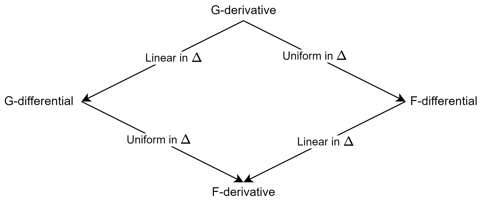

**Difficulty**: Undergraduate Students

Sometimes notions in one-dimensional spaces are not easy to generalize to multi-dimensional spaces. I believe the notion of a differential (or the derivative in one-dimensional space) is one of them.

# Differentials: useful but naive surrogates

In one-dimensional calculus, students are typically introduced to the definition of the derivative of a function $f:\mathbb{R}\mapsto\mathbb{R}$ by constructive means. Specifically, if 

$$(\theta)\qquad\lim_{t\downarrow0}\frac{f(x+t)-f(x)}{t}=\lim_{t\uparrow0}\frac{f(x+t)-f(x)}{t}=\lim_{t\to0}\frac{f(x+t)-f(x)}{t}=f'(x)$$ 

then $f'(x)$ is called the (univariate) **derivative of $f$ at $x$**. In this special setting, the existence of $f'(x)$ enjoys all the nice properties of the F-derivative (e.g., continuity and tangency) and G-derivative (e.g., chain rule) *without the issues of construction*.

It is then natural to ask whether $(\theta)$ could be extended to the multivariate setting while simultaneously keeping (i) its constructive nature *and* (ii) the nice properties of the F-derivative (and G-derivative). Below, we show an approach of obtaining (i) which partially obtains (ii).

A function $f:\mathbb{R}^{n}\mapsto\mathbb{R}^{m}$ is said to have a **Gateaux** (or **G-**) **differential** **at** $x\in\mathbb{R}^{n}$ in the direction $\Delta\in\mathbb{R}^{n}$ if the function 

$$(\pi_{1})\qquad V^{f}(x,\Delta)=\lim_{t\to0}\frac{f(x+t\Delta)-f(x)}{t},$$ 

called the G-differential, is well-defined. Here, the limit is taken over all subsequences $$\{t_{n}\}\subseteq\mathbb{R}$$. If, in addition, 

$$(\pi_{2})\qquad\lim_{\Delta\to0}\frac{\|f(x+t\Delta)-f(x)-V^{f}(x,\Delta)\|}{\|\Delta\|}=0$$ 

where the limit is taken over all subsequences $$\{\Delta_{n}\}\subseteq\mathbb{R}^{n}$$, then $f$ is also said to have a **Fréchet** (or **F-**) **differential at** $x\in\mathbb{R}^{n}$ (also denoted by $V^{f}(x,\Delta)$).

Let us now make a few glancing remarks.

-   Unlike the definitions of an F-derivative or G-derivative, the definition of $V^{f}$ in $(\pi_{1})$ is constructive.

-   Similar to the one-dimensional case, the well-definedness of $V^{f}(x,\Delta)$ equivalent to the left and right limits (in terms of $t$) being equal.

-   In the one-dimensional case of $n=m=1$, we have $$V^{f}(x,1)=f'(x)=-V^{f}(x,-1).$$

-   It is straightforward to see that if $V^{f}(x,\Delta)$ exists for $\Delta\in\mathbb{R}^{n}$ and is linear in $\Delta$ then $$V^{f}(x,\Delta)={\cal B}_{x}^{f}(\Delta)$$. Furthermore, if $(\pi_{2})$ holds then $$V^{f}(x,\Delta)={\cal A}_{x}^{f}(\Delta)$$.

While we have fulfilled property (i), the following anti-properties (given as exercises) show that property (ii) cannot be fully realized.

-   *Exercise*. Consider the function 

$$f(x_{1},x_{2})=\begin{cases}
    0, & \text{if }x=0,\\
    \dfrac{x_{1}x_{2}^{2}}{x_{1}^{2}+x_{2}^{4}}, & \text{otherwise}.
    \end{cases}$$ 

Show that $V^{f}(0,\Delta)$ exists for every $\Delta\in\mathbb{R}^{2}$, but $f$ does not have a G-derivative at zero. As a bonus, show that $f$ is not continuous at zero.

-   Consider the function 

$$f(x_{1},x_{2})={\rm sgn}(x_{2})\min(|x_{1}|,|x_{2}|)$$ 

which is clearly continuous at zero. Show that $V^{f}(0,\Delta)$ exists for every $\Delta\in\mathbb{R}^{2}$, but $f$ does not have a G-derivative at zero.

On the other hand, the nice property about the G-differential (resp. F-differential) is that it gives a good initial estimate for the G-derivative (or F-derivative) if one can extract the appropriate linear form from it (and verify property $(\pi_{2})$ in the case of the F-derivative) or we know that $f$ is G-differentiable (resp. F-differentiable). A classic example of the utility of the differential is in deriving the derivative of the log determinant of a matrix, which we show below.

Let $$f:{\cal S}_{++}^{n}\mapsto\mathbb{R}$$ be given by $f(M)=\log\det M$, where $${\cal S}_{++}^{n}$$ denotes the space of positive definite matrices. Since $\log(\cdot)$ is differentiable on $\mathbb{R}_{++}$ and $h(M)=\det(M)$ is a polynomial function of the components of $M$ (and, hence differentiable) we can obtain the derivative of $f$ by differentials and the chain rule. Using some standard linear algebra techniques, the F-differential of $h$ (and, hence, the F-derivative of $h$) is then given by 

$$\begin{aligned}
V^{h}(M,\Delta) & =\lim_{t\to0}\frac{\det(M+t\Delta)-\det(M)}{t}\\
 & =\lim_{t\to0}\frac{\det(M[I+tM^{-1}\Delta])-\det(M)}{t}\\
 & =\det(M)\lim_{t\to0}\frac{\det(I+tM^{-1}\Delta)-1}{t}\\
 & =\det(M){\rm tr}(M^{-1}\Delta)={\cal A}_{M}^{h}(\Delta),\end{aligned}$$ 

 Hence, by the chain rule, we have 

 $${\cal A}_{M}^{f}(\Delta)={\cal A}_{\det M}^{\log(\cdot)}{\cal {\cal A}}_{M}^{h}(\Delta)=\frac{\det(M){\rm tr}(M^{-1}\Delta)}{\det(M)}={\rm tr}(M^{-1}\Delta).$$ 

 One can even obtain the gradient $\nabla f(x)=M^{-T}$ by using the fact that 

 $${\cal A}_{M}^{f}(\Delta)={\rm tr}(M^{-1}\Delta)=\left\langle M^{-T},\Delta\right\rangle .$$

To close, let us present this nice schematic of the various relations between G/F-derivatives and G/F-differentials in terms of the displacement variable $\Delta$ that shows up in $${\cal A}_{x}^{f}(\Delta)$$, $${\cal B}_{x}^{f}(\Delta)$$, and $V^{f}(x,\Delta)$.

